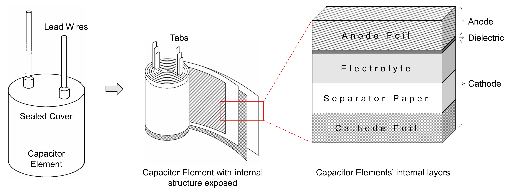
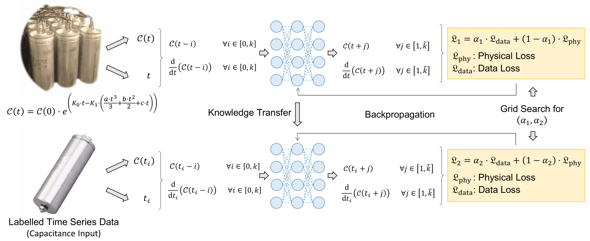
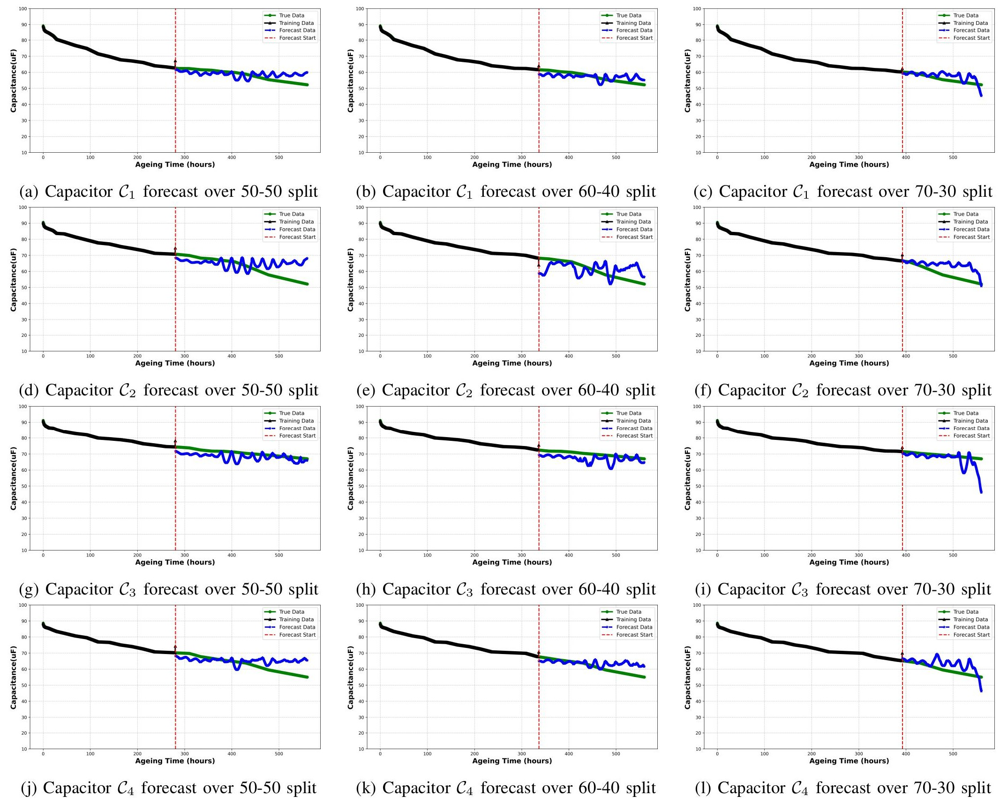
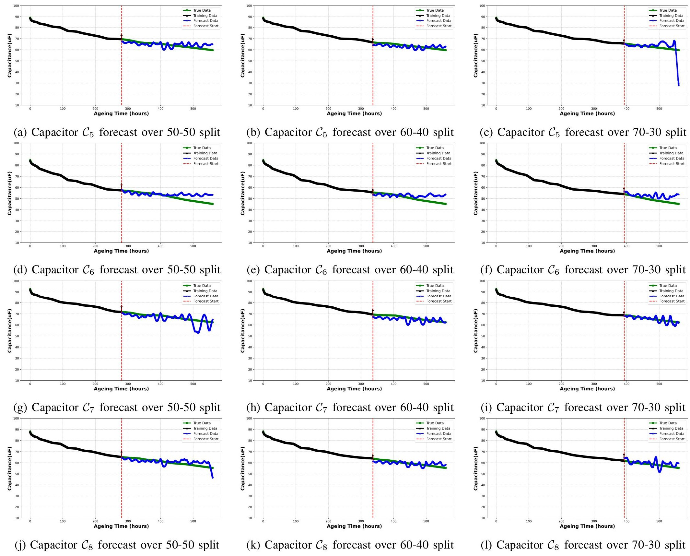

# `PoFINN`: Integrating Physics of Failure and Neural Networks for Long-term Degradation Forecasting of Aluminum Electrolytic Capacitors

The work introduces `PoFINN`, a novel Physics-Informed Neural Network (`PINN`) framework for predicting the _long-term degradation_ of _Aluminum Electrolytic Capacitors_ (AECs) under storage conditions. By integrating domain knowledge of electrolyte evaporation, `PoFINN` combines _physics-based_ and _data-driven_ approaches, offering superior accuracy and interpretability. The framework operates in two phases—**Pre-Training** and **Real-Time Training**—using a hybrid loss function that incorporates both physical and data-driven constraints. `PoFINN` outperforms traditional methods in long-term predictions, especially for complex, non-linear degradation behaviors, enhancing predictive maintenance and reliability.

Following is the architectural view of the `PoFINN` model. 

Following are the true versus predicted forecasts for the capacitors C1, C2, C3, and C4.

Following are the true versus predicted forecasts for the capacitors C5, C6, C7, and C8.

